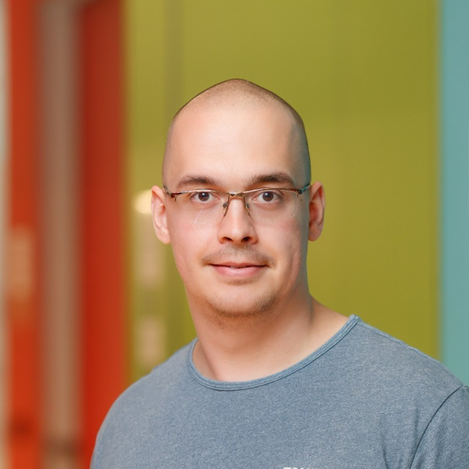

My name is Ilia Luchnikov. Currently, I am a postdoctoral researcher at the University of Geneva. I received my PhD in Theoretical Physics in 2020 at the Moscow Institute of Physics and Technology under supervision of [Sergey Filippov](https://sites.google.com/view/filippovsn/home). Prior to this, I also received MSc in 2017 and BSc in 2015 at the same university. My fields of interest include high-performance computing, applied mathematics, programming languages, machine learning and quantum technologies. A detailed version of my academic CV in the pdf format is available [here](../assets/img/luchnikov_cv_academic.pdf).

Im am not 100% academic person, I am equally interested in development of software products. [Here](../assets/img/luchnikov_cv_industrial.pdf) one can find my industrial CV.

The list of my academic publications is available on a [Google scholar](https://scholar.google.com/citations?user=5wB0-tkAAAAJ&hl=en) page; some of my experimental codding projects/prototypes are available in [GitHub](https://github.com/LuchnikovI); one also can find me in [LinkedIn](https://ru.linkedin.com/in/ilia-luchnikov-56723b143)
